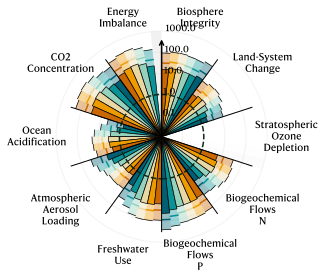

# Planetary boundaries visualisation

This repository contains the code to replicate the chart used in the study: Michaël Lejeune, Sami Kara, Michael Hauschild et al. Pathways to global hydrogen production within planetary boundaries, 26 February 2025, PREPRINT (Version 1) available at Research Square [https://doi.org/10.21203/rs.3.rs-5917828/v1]

If you use this code, please cite the above.

Example of the chart:

**NOTE**: The code is not optimised and is provided as is. Future updates will be made to improve the code and make it more user-friendly.
